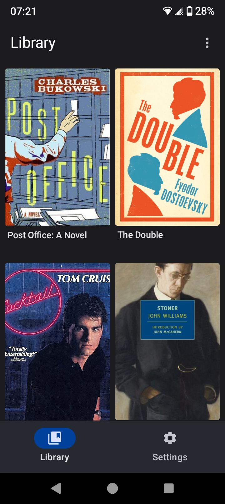
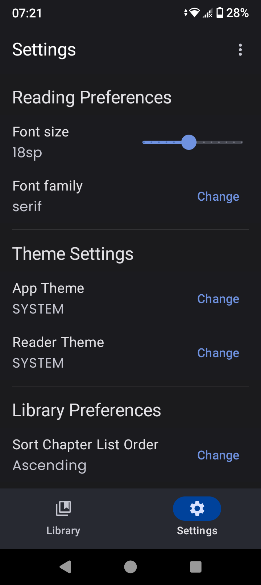
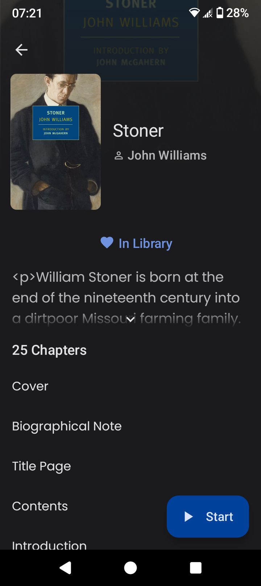

# Rose Reader

A lightweight EPUB reader for Android that does one thing — and does it well.  
Inspired by NovelDokusha, Tachiyomi, Mihon, and shrimqy's Mizumi to create something simple, clean, and lasting.

---

## Features

- Local EPUB reading — and only EPUB. No distractions.
- Chapter navigation built right into the reader.
- Full image and GIF support.
- Position recall — because your time is precious.
- Runs smooth, even on devices others have long given up on.

---

## Screenshots

A picture says more than a thousand promises.  
Here’s a glimpse of what you’re stepping into with Rose:

|             Library             |             Settings              |
|:-------------------------------:|:---------------------------------:|
|     |      |
|           Book Info             |            Reader                 |
|   |        |

---

## The Pitch

Picture this: a world where your apps don't shout for your attention — they whisper.

Where less isn't just more — it’s everything.

Rose was born from a simple, stubborn idea:  
*What if a reader did less... but did it better?*

I tried my hand at building one before — you’ll find *Vera* gathering dust in the archives.  
It wasn’t terrible. It just wasn’t *right.*  
And like any good creative chasing the next shiny object, I walked away from it. More than once.

But not this time.

Rose is the distilled spirit of Mizumi — itself a lean remix of NovelDokusha.  
Book-story by Acclorite? A wonder. But it tried to be too much at once — a translator, an animator, a circus act.  
I didn’t need fireworks.  
I needed a quiet place to read.

So I took Mizumi’s 8,000 lines of code, and stripped it to the bone — down to 7,000 lines that mattered.  
Gone are the translators, the scraping, the networking, the gimmicks.  
What’s left is pure, undiluted reading.

Want the details? They’re tucked neatly away in the [CHANGELOG.md](CHANGELOG.md). Like an old briefcase full of pitches that still matter.

---

## What Really Happened

It started in October 2024.  
A folder. A project. *Rose.*

Inside that folder lived ten tarball archives — *v1* through *v10* — each one a chapter of slow, stubborn progress.  
My old-school method of backup: simple, primitive, reliable enough... or so I believed.

Each version was a little better than the last.  
A little tighter. A little closer to the truth of what I wanted Rose to be.

But fate is a cruel partner.

One Friday night — a few drinks too deep, a few bad keystrokes — and the whole archive was wiped away.  
Weeks of work, gone in a flash.  
The only survivor?  
A forgotten microSD card, tucked away in a drawer — carrying an old backup of *v1.* Outdated, imperfect, but alive.

After that... the fire to rebuild it from scratch was gone.  
The settings page, the theme selector, all the polish I meant to add — left unfinished, like a half-sketched ad campaign that never aired.

Sometimes, you realize it’s not about rebuilding.  
It’s about handing off the torch.

Rose isn’t perfect.  
It isn’t finished.  
But it’s real.

Now it’s yours.  
Take it. Shape it. Make it better than I ever could.

---

## Fork Family Tree

NovelDokusha → Mizumi → Rose

Every idea has roots.  
Rose didn’t just appear out of thin air — it’s the refined product of a lineage that dared to think differently.

---

## Implementation Notes

Rose was built from Mizumi commit `da8282eab2`, chosen for one simple reason:  
It had the right bones.

What Mizumi brought to the table:

- Solid EPUB parsing — dependable and strong.
- Image handling — crisp, effortless.
- Material 3 design — using Jetpack Compose to build for tomorrow.
- Clean, readable code — no spaghetti, no smoke and mirrors.
- Core features — and none of the excess.

And just as importantly, what Mizumi left out:

- No text-to-speech clutter.
- No bottom bar weighing down the reader.
- No network scraping to gum up the experience.

When you want the best, you don’t reinvent the wheel.  
You find the best version — and make it better.

---

## Acknowledgements

- [Nina](https://github.com/nanihadesuka) for [NovelDokusha](https://github.com/nanihadesuka/NovelDokusha) — the first spark.
- [shrimqy](https://github.com/shrimqy) for [Mizumi](https://github.com/shrimqy/Mizumi) — the foundation that made Rose possible.
- JetBrains — for giving us Kotlin, a tool as elegant as the work demands.
- The Jetpack Compose team — for building a modern UI toolkit that feels effortless.

Want to see it for yourself?  
Clone the project, run `assembleRelease`, and step into a reading experience that feels like coming home.

---

## Acknowledgements Emphasized

It would be a crime not to give special thanks to [shrimqy](https://github.com/shrimqy).

Stripping 20,000 lines of code down to its essentials isn’t a task — it’s a war.  
And shrimqy won it beautifully.  
Mizumi wasn’t just a fork — it was a revelation.  
After I debloated it, it became my daily reader. My quiet refuge in a noisy world.

Thanks to shrimqy’s work, I didn’t have to start from scratch.  
I just had to find the path.

Because of that, Rose exists — simple, fast, honest.  
A reader for people who still believe less can be everything.

I hope someone else picks up where I leave off.  
Maybe you’ll find the same peace I did.

Maybe you’ll build something even better.

---
